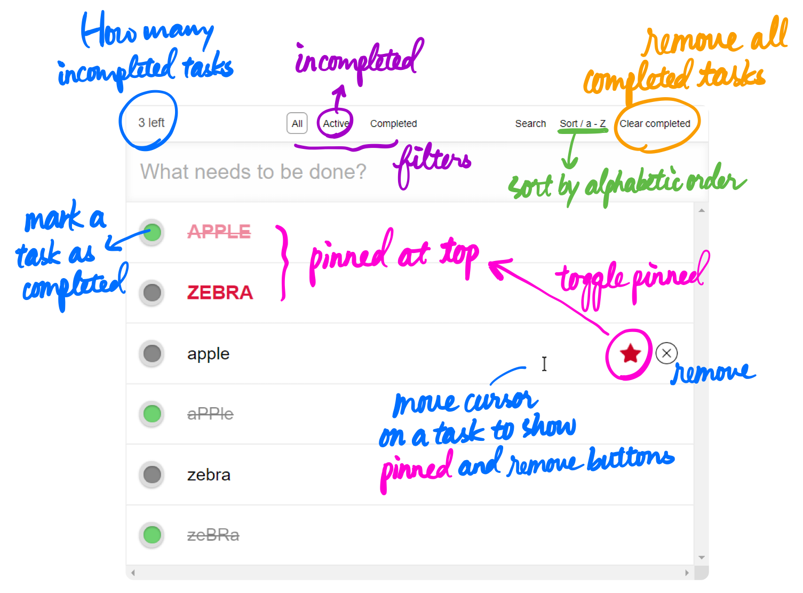
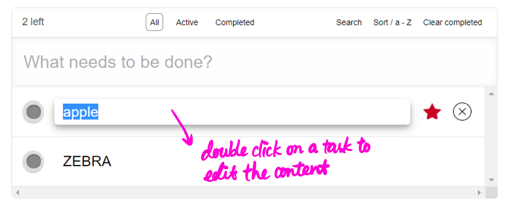
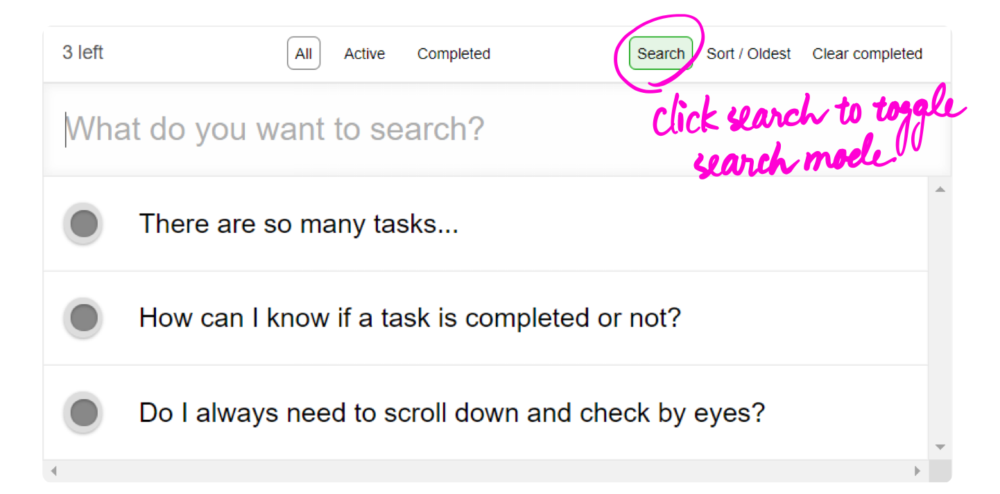
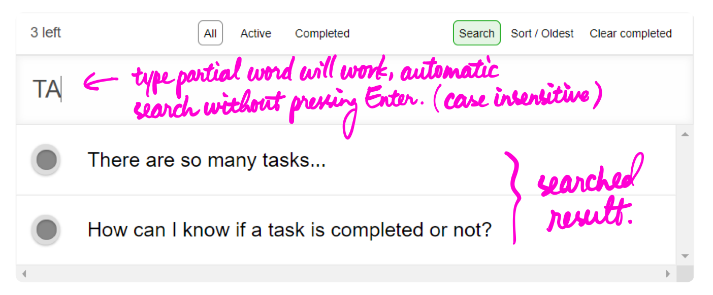

# TODO List in pure JS

## 介面描述
- 藍色字體為required的基本功能，其他顏色字體則為進階功能。
- 我將原本的footer區塊移到上排。因為隨著task數量增加，footer的位置會動態改變，每次點的位置都不一樣。且這裡footer擺放的資訊和功能其實都是common case (而不是像作者簽名、copyright之類的)，放在固定、方便操作的最上排我覺得是比較適當的。

## 功能列表
### 基本功能
1. 可建立數個 TodoItems
2. 可新增刪除任意 TodoItem
3. 可勾選已完成的 TodoItem
4. 在畫面上顯示已完成的 TodoItems 的不同
5. 統計並顯示未完成的 TodoItem 數量

### 進階功能
1. **紫色**：filter 所有/已完成/未完成項目
2. **橘色**：一鍵刪除所有已完成項目
3. **排序（綠色）**：對目前的顯示的 task (根據filter) 進行排序。
    - 有四種排序模式：
        - latest：越新加入的 task 排在越上面
        - oldest：越新加入的 task 排在越下面
        - a - Z：將 task 做字母排序由小到大排列，a < A < z < Z。
        - Z - a：將 task 做字母排序由大到小排列，Z > z > A > a。
    - 點擊左鍵可切換下一個模式，點擊右鍵則切換上一個模式。
4. **置頂（粉色）**：點擊星星可以將 task 置頂，再點一下可取消置頂。置頂的優先權高於排序，而同樣置頂的 tasks 間則依據目前的排序模式進行排列。
5. **編輯**：對任一 task 連點兩下可以進行編輯。按 Enter、Esc、或點擊頁面其他位置可自動儲存並結束編輯。

6. **搜尋**：點擊右上角的Search可進入搜尋模式，原本用來新增 task 的打字區則用來輸入想搜尋的 pattern（case-insensitive）。輸入 pattern 期間頁面會隨時更新搜尋結果，不需特別按 Enter 來進行搜尋。
    - #### Before search
    
    - #### After search
    